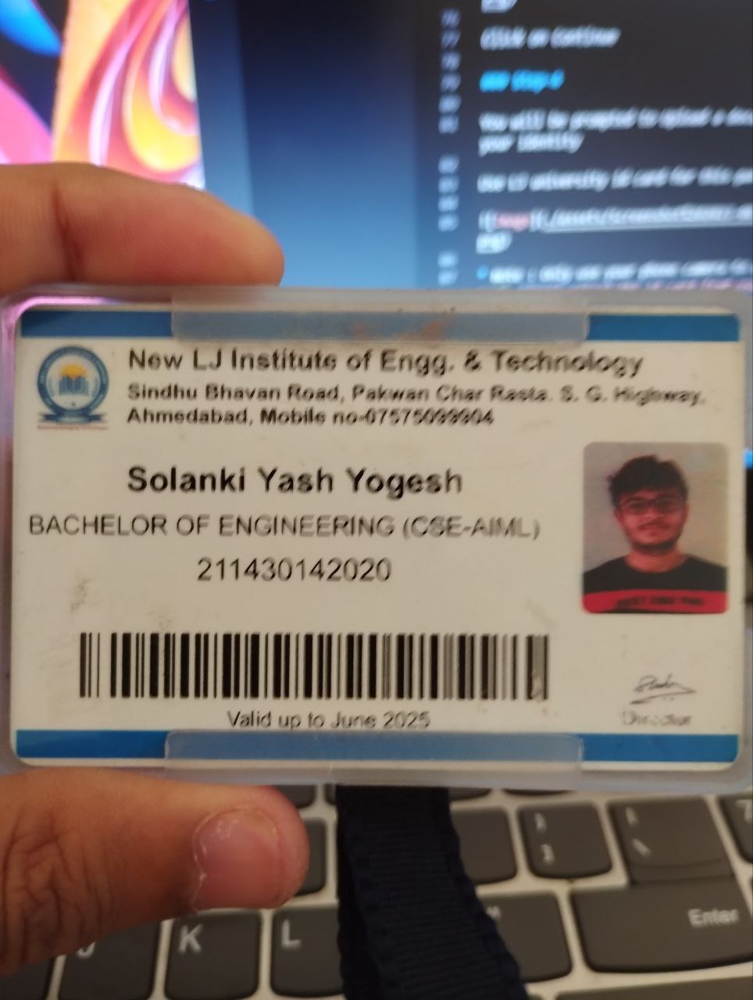

# HTML

## Website Basics

_How Website works._  
What is a website?  
How internet works?  
What is HTTP?  
What is a domain name?  
What is web hosting?  
What is a server?  
What is a client?  
What is a browser?  

## HTML Basics

- [ ] HTML Introduction
- [ ] HTML Editors
- [ ] HTML Basic Examples
- [ ] HTML Elements
- [ ] HTML Attributes

## Practice

Try to clone this HTML only website : [BerkShire](https://www.berkshirehathaway.com/)

Second Reference [MotherFuckingWebsite](http://motherfuckingwebsite.com)

## HTML Semantics

Learn how to effectively use meaningful tags and reduce the amounts of `div` and `span` in your website

Learn tags such as `article` , `section` ,`aside` , `figure` , `figcaption`

__Before starting to learn css , you must have a github student developer pack . You can get it for free using our New LJ's id-card.__

# How to get Github Student Developer Pack

__Follow all the below steps on your Mobile only__

### Step-1

Get a fresh Gmail account

* Go to gmail and create a new gmail account to get started with your developer pack

### Step-2 

Sign-up to [Github](https://github.com/signup?ref_cta=Sign+up&ref_loc=header+logged+out&ref_page=%2F&source=header-home)

This is how it will look 

Once you successfully sign up , you will get this page: 

_Click on `Continue for free`._

### Step-3

Head over to github Student Developer Pack Page [Click_here](https://education.github.com/discount_requests/application)

This is how it should look

Get to the bottom and Select `Lok Jagruti Institute of Engineering and Technology` from the list of schools

Click on Continue

### Step-4

You will be prompted to Upload a document to verify your identity

Use LJ university id card for this purpose

* Note : Only use your phone camera to upload the Id card. `Don't upload the id card from your laptop or pc or Your phone gallery as it gets rejected `

Make sure the id card has your name , college name and Date of expiry fully visible 

### Step-5

All the above steps are done , now you just have to wait for the approval

It Usually takes 2-3 days for the approval

Also , you will get a mail from github to your gmail account once your request is approved

If your request is rejected , you can re-apply. Make sure you upload the id card properly.

# CSS 

Considering you have completed the HTML part , now you can start learning CSS

Use the email that has Student benefits to sign up to [Frontend Masters](https://frontendmasters.com/dashboard/)

Login and start learning CSS from [Here](https://frontendmasters.com/courses/getting-started-css/)

* Then learn all these
    * [InterMediate_HTML_AND_CSS](https://frontendmasters.com/courses/intermediate-html-css/)
    * [CSS_Grids_And_Flexbox_For_Responsive_Web_Design](https://frontendmasters.com/courses/css-grid-flexbox-v2/)

    * Once you are done with all the above courses and you are confident enough , you can start learning CSS Frameworks

# CSS Frameworks

CSS Frameworks Include Bootstrap , Tailwind , Materialize , Bulma etc

My suggestion would be to start with Bootstrap and then learn Tailwind.

[Bootstrap_Tutorial](https://youtu.be/Jyvffr3aCp0)

Now you need to learn how to read docs.  So challenge yourself to build a website using tailwind
.

Refer this link

[Tailwind_Tutorial](https://youtu.be/Ksn1tThNTjI)

Once you are done with all the above , you can start by cloning a website. Take a website which you feel has a very flawless and highly responsive design. Add your own touch to it and try to make it better.